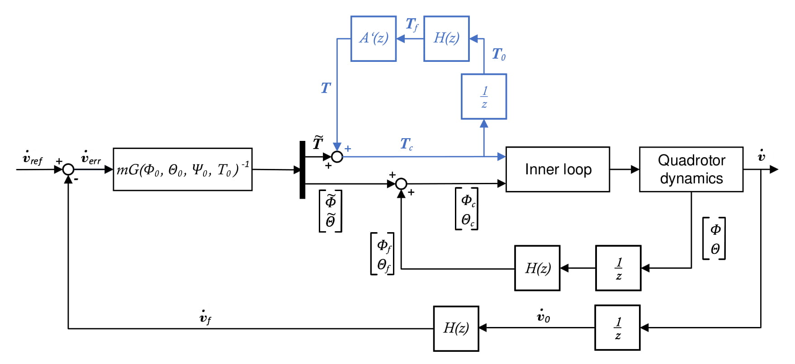

# Semester Thesis: Design, Implementation and Evaluation of an Incremental Nonlinear Dynamic Inversion Controller for a Nano-Quadrotor

Autor: Evghenii Volodscoi

	

## Abstract 
Incremental Nonlinear Dynamic Inversion (INDI) is a promising control technique, widely used
for control of different types of aircraft systems. Besides providing high-performance nonlinear
control, this controller type does not require a detailed model of the controlled aircraft and is
effective against disturbances. This semester thesis describes the development of an INDI controller
to control the attitude and the position of a nano-quadrotor. It begins with the derivation
of the control algorithm. The controller is then firstly developed in the Simulink environment
and afterwards implemented on the embedded hardware of the quadrotor. Subsequently, the
implementation aspects of the INDI controller such as estimation of the control effectiveness,
measurement of the actuator time constant and estimation of the thrust mapping parameter
are discussed. Finally, the implemented controller is tested on the ability to cope with disturbance.
The final version of the implemented control algorithm is available via official open
source firmware of the Crazyflie quadrotor.

The C-code of the INDI position controller implemented in the framework of this semester thesis was merged with the official firmware of the Crazyflie Quadrotor. The corresponding pull request with detailed description of the final software structure can be found under the following link: 

https://github.com/bitcraze/crazyflie-firmware/pull/568
